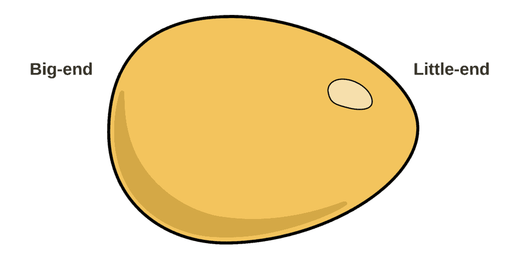
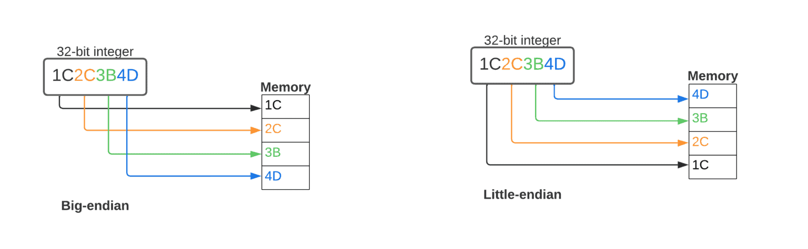

# Overview 

In [computing](https://en.wikipedia.org/wiki/Computing), **endianness** is the order in which [bytes](https://en.wikipedia.org/wiki/Byte) within a [word](https://en.wikipedia.org/wiki/Word_(data_type)) of digital data are transmitted over a [data communication](https://en.wikipedia.org/wiki/Data_communication) medium or [addressed](https://en.wikipedia.org/wiki/Memory_address) (by rising addresses) in [computer memory](https://en.wikipedia.org/wiki/Computer_memory), counting only byte [significance](https://en.wikipedia.org/wiki/Bit_numbering#Bit_significance_and_indexing) compared to earliness. Endianness is primarily expressed as **big-endian** (BE) or **little-endian** (LE), terms introduced by [Danny Cohen](https://en.wikipedia.org/wiki/Danny_Cohen_(computer_scientist)) into computer science for data ordering in an [Internet Experiment Note](https://en.wikipedia.org/wiki/Internet_Experiment_Note) published in 1980.[[1]](https://en.wikipedia.org/wiki/Endianness#cite_note-HOLY-1) The adjective *endian* has its origin in the writings of 18th century Anglo-Irish writer [Jonathan Swift](https://en.wikipedia.org/wiki/Jonathan_Swift). In the 1726 novel [*Gulliver's Travels*](https://en.wikipedia.org/wiki/Gulliver%27s_Travels), he portrays the conflict between sects of Lilliputians divided into those breaking the shell of a [boiled egg](https://en.wikipedia.org/wiki/Boiled_egg) from the big end or from the little end.[[2]](https://en.wikipedia.org/wiki/Endianness#cite_note-2)[[3]](https://en.wikipedia.org/wiki/Endianness#cite_note-3) By analogy, a CPU may read a digital word big end first, or little end first.

在计算机领域，内迭代是指数字数据字内的字节在数据通信介质上传输或在计算机内存中寻址（通过上升地址）的顺序，只计算字节的重要程度，而不计算早期程度。端位主要表示为大端位（BE）或小端位（LE），这是丹尼-科恩（Danny Cohen）在 1980 年出版的互联网实验说明中引入计算机科学的数据排序术语。在 1726 年出版的小说《格列佛游记》中，他描写了小人国各教派之间的冲突，这些教派分为从大端或从小端打破煮熟鸡蛋外壳的教派[2][3]。

Computers store information in various-sized groups of binary bits. Each group is assigned a number, called its *address*, that the computer uses to access that data. On most modern computers, the smallest data group with an address is eight bits long and is called a byte. Larger groups comprise two or more bytes, for example, a [32-bit](https://en.wikipedia.org/wiki/32-bit) word contains four bytes. There are two possible ways a computer could number the individual bytes in a larger group, starting at either end. Both types of endianness are in widespread use in digital electronic engineering. The initial choice of endianness of a new design is often arbitrary, but later technology revisions and updates perpetuate the existing endianness to maintain [backward compatibility](https://en.wikipedia.org/wiki/Backward_compatibility).

A big-endian system stores the [most significant byte](https://en.wikipedia.org/wiki/Most_significant_byte) of a word at the smallest [memory address](https://en.wikipedia.org/wiki/Memory_address) and the [least significant byte](https://en.wikipedia.org/wiki/Least_significant_byte) at the largest. A little-endian system, in contrast, stores the least-significant byte at the smallest address.[[4]](https://en.wikipedia.org/wiki/Endianness#cite_note-4)[[5]](https://en.wikipedia.org/wiki/Endianness#cite_note-5)[[6]](https://en.wikipedia.org/wiki/Endianness#cite_note-6) Of the two, big-endian is thus closer to the way the digits of numbers are written left-to-right in English, comparing digits to bytes. *Bi-endianness* is a feature supported by numerous computer architectures that feature switchable endianness in data fetches and stores or for instruction fetches. Other orderings are generically called *middle-endian* or *mixed-endian*.[[7]](https://en.wikipedia.org/wiki/Endianness#cite_note-7)[[8]](https://en.wikipedia.org/wiki/Endianness#cite_note-8)[[9]](https://en.wikipedia.org/wiki/Endianness#cite_note-9)[[10]](https://en.wikipedia.org/wiki/Endianness#cite_note-10)

Big-endianness is the dominant ordering in networking protocols, such as in the [Internet protocol suite](https://en.wikipedia.org/wiki/Internet_protocol_suite), where it is referred to as *network order*, transmitting the most significant byte first. Conversely, little-endianness is the dominant ordering for processor architectures ([x86](https://en.wikipedia.org/wiki/X86), most [ARM](https://en.wikipedia.org/wiki/ARM_architecture) implementations, base [RISC-V](https://en.wikipedia.org/wiki/RISC-V) implementations) and their associated memory. [File formats](https://en.wikipedia.org/wiki/File_format) can use either ordering; some formats use a mixture of both or contain an indicator of which ordering is used throughout the file.[[11]](https://en.wikipedia.org/wiki/Endianness#cite_note-11)

# **2. What Is Endianness?**

[Big Endian vs. Little Endian | Baeldung on Computer Science](https://www.baeldung.com/cs/big-endian-vs-little-endian)

While most modern languages are written left-to-right like this very sentence, some others are written right-to-left and even not horizontally. Endianness is similar to languages written from left to right or right to left. It is an excellent analogy to understand the basic idea behind endianness.

**In computing systems, bytes are the key structures. Their representation in different formats in different machines creates endianness.** While machines can read their own data, problems arise when one computing system stores and another tries to read. The solution is simple, we need to agree to a standard format and always include a header that defines the data format. If the header is backward, it means it’s another format, and the system should convert it.

**So, in computing, we define endianness as the order of bytes inside a word of data stored in computer memory. Big-endian and little-endian are the two main ways to represent endianness.** Big-endian keeps the most significant byte of a word at the smallest memory location and the least significant byte at the largest. On the other hand, little-endian keeps the least significant address at the smallest memory location. Many computer architectures offer adjustable endianness for instruction fetches, data fetches, and storage to support bi-endianness. There are also some other orderings like middle-endian or mix-endian.

Endianness can also refer to the order in which bits are transferred via a communications channel. When creating ports using the C programming language, we have to make declarations to adjust the communication between parties.

在 Little Endian 中，低位字节存储在低地址，高位字节存储在高地址。因此，在这段代码中，**`buffer[0]`** 对应于最低有效字节，**`buffer[1]`** 对应于次低有效字节

`return (static_cast<uint32_t>(buffer[0])) |       (static_cast<uint32_t>(buffer[1]) << 8) |       (static_cast<uint32_t>(buffer[2]) << 16) |       (static_cast<uint32_t>(buffer[3]) << 24);`

# **3. Where Is the “Endianness” Coming From?**

Even though it sounds weird, we understand the concept better when we learn where the “endianness” word comes from. While the terms big-endian and little-endian are coined by [Danny Cohen](https://en.wikipedia.org/wiki/Danny_Cohen_(computer_scientist)), who is one of the key figures behind the separation of [Transmission Contol Protocol (TCP)](https://www.baeldung.com/cs/udp-vs-tcp#tcp) and [Internet Protocol (IP)](https://www.baeldung.com/cs/popular-network-protocols#internet-protocol-ip), the adjective endian has its origin in the novel Gulliver’s Travels. In this novel, Jonathan Swift depicts the fight between Lilliputians who are separated into two groups that break an egg’s shell from the big end or the little end: